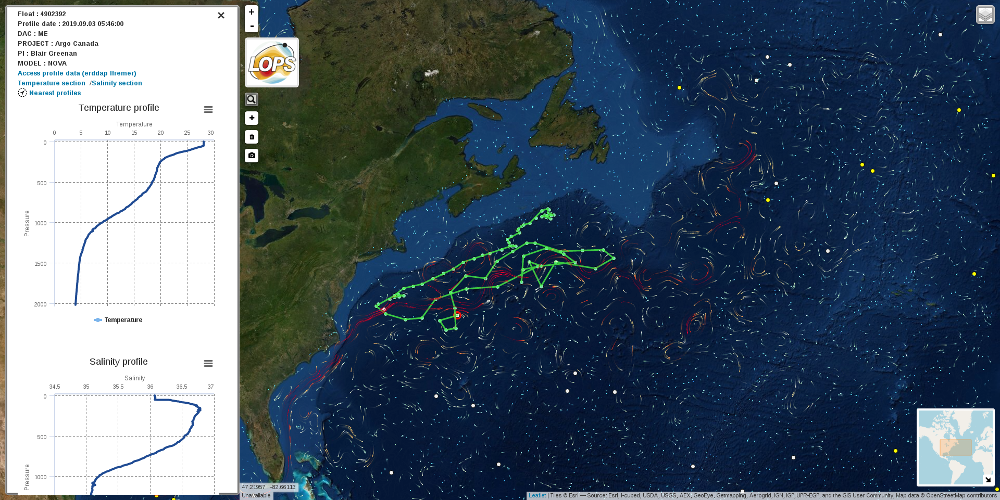

DIVAA
=====

KBLM  
LOPS-2017  
DIVAA : Display Interface for Velocity And Argo data  
CODE DEDICATED TO VISUALIZE [ARGO](http://www.argo-france.fr/fr/home/) DATA COMBINED TO AVISO SURFACE CURRENT AND ANDRO DATA  
BASED ON [LEAFLET-VELOCITY](https://github.com/danwild/leaflet-velocity)  
bin/ & update_all.csh do not appear in web front  

Requirements
------------
DIVAA needs json_reformat tool from yajl (https://lloyd.github.io/yajl/)

On Ubuntu:
```
apt-get install yajl-tools
```
On RHEL/Centos:
```
dnf install yajl-devel
```

DIVAA Python requirements was referenced inside requirements file. Please pip this requirements file before run.
```
pip install -r requirements.txt
```
